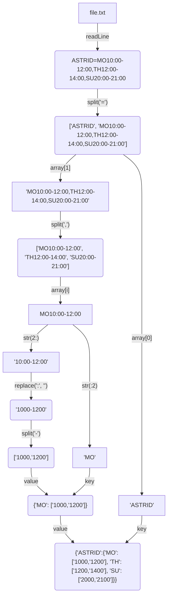

# How often employees meet each other in the office 

---

## The Problem

The company ACME offers their employees the flexibility to work the hours they want. But due to some external circumstances they need to know what employees have been at the office within the same time frame

The goal of this exercise is to output a table containing pairs of employees and how often they have coincided in the office.

## Examples

### Example 1

##### INPUT

```txt
RENE=MO10:00-12:00,TU10:00-12:00,TH01:00-03:00,SA14:00-18:00,SU20:00- 21:00
ASTRID=MO10:00-12:00,TH12:00-14:00,SU20:00-21:00
ANDRES=MO10:00-12:00,TH12:00-14:00,SU20:00-21:00
```

##### OUTPUT

```sh
ASTRID-RENE: 2
ASTRID-ANDRES: 3
RENE-ANDRES: 2
```

### Example 2

##### INPUT

```txt
RENE=MO10:15-12:00,TU10:00-12:00,TH13:00-13:15,SA14:00-18:00,SU20:00-21:00
ASTRID=MO10:00-12:00,TH12:00-14:00,SU20:00-21:00
```

##### OUTPUT

```sh
RENE-ASTRID: 3
```

## Solution

### Language

[Python](solution.py)

### prepare_data(file: str)

#### Input

String --> Path

##### Example

<details>

  <summary>'/home/mrmango1/Documents/file.txt'</summary>
  
```txt
ASTRID=MO10:00-12:00,TH12:00-14:00,SU20:00-21:00
RENE=MO10:15-12:00,TU10:00-12:00,TH13:00-13:15,SA14:00-18:00,SU20:00-21:00
```

</details>



#### Return

<details>
  <summary>Click me</summary>

```python
#python dictionary - javascript object
{
  "ASTRID": {
    "MO": [
      "1000",
      "1200"
    ],
    "TH": [
      "1200",
      "1400"
    ],
    "SU": [
      "2000",
      "2100"
    ]
  },
  "RENE": {
    "MO": [
      "1015",
      "1200"
    ],
    "TU": [
      "1000",
      "1200"
    ],
    "TH": [
      "1300",
      "1315"
    ],
    "SA": [
      "1400",
      "1800"
    ],
    "SU": [
      "2000",
      "2100"
    ]
  }
}
```

</details>
