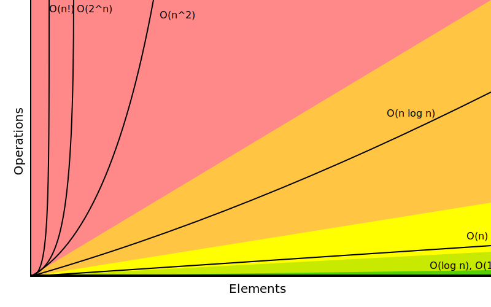
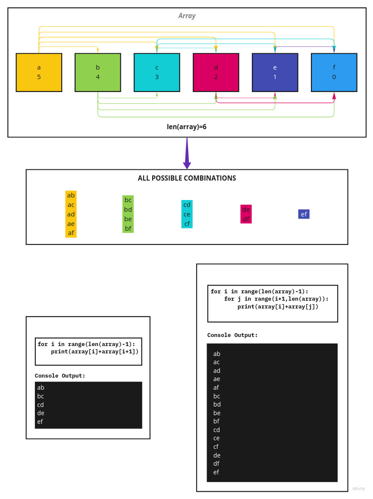
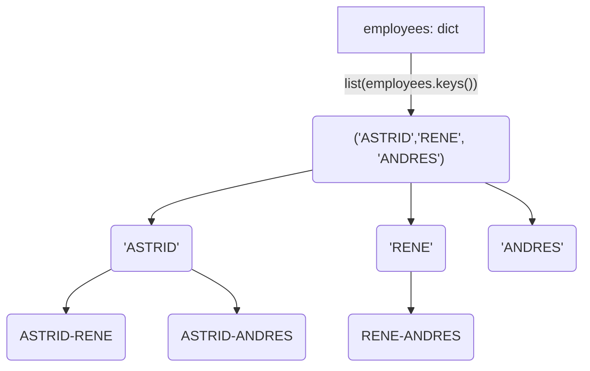
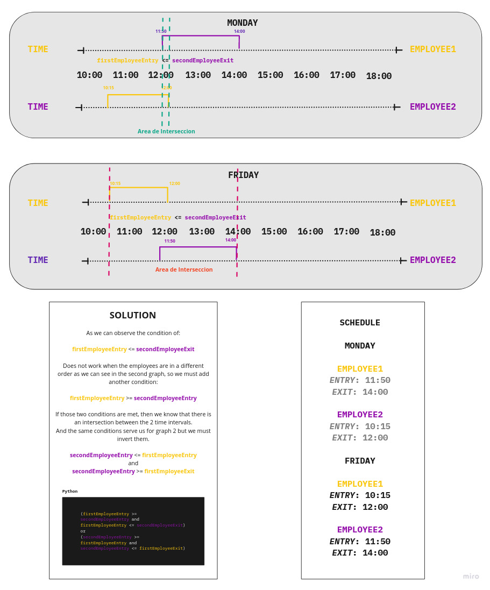
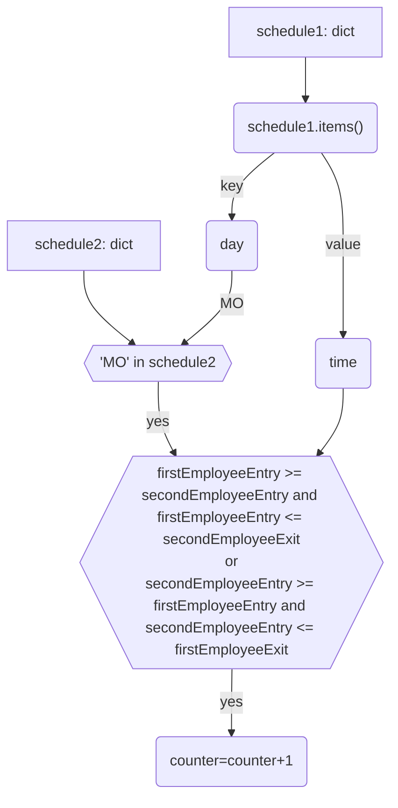

# How often employees meet each other in the office

[](https://github.com/mrmango1/programing-exercise/actions/workflows/pytest.yml) [](https://github.com/mrmango1/programing-exercise/actions/workflows/pytest.yml)[](https://github.com/mrmango1/programing-exercise/actions/workflows/pytest.yml)

---

## Table of Contents

- [The Problem](#the-problem)
- [Solution](#solution)
  - [Prepare the data](#1-prepare-the-data)
  - [Algorithm of permutations](#2-algorithm-of-permutations)
  - [Compare two time intervals](#3-compare-two-time-intervals )
- [Execute the code](#execute-the-code)

## The Problem

The company ACME offers their employees the flexibility to work the hours they want. But due to some external circumstances they need to know what employees have been at the office within the same time frame

The goal of this exercise is to output a table containing pairs of employees and how often they have coincided in the office.

### Examples

#### Sample Input 0

```txt
RENE=MO10:00-12:00,TU10:00-12:00,TH01:00-03:00,SA14:00-18:00,SU20:00- 21:00
ASTRID=MO10:00-12:00,TH12:00-14:00,SU20:00-21:00
ANDRES=MO10:00-12:00,TH12:00-14:00,SU20:00-21:00
```

#### Sample Ouput 0

```sh
ASTRID-RENE: 2
ASTRID-ANDRES: 3
RENE-ANDRES: 2
```

#### Sample Input 1

```txt
RENE=MO10:15-12:00,TU10:00-12:00,TH13:00-13:15,SA14:00-18:00,SU20:00-21:00
ASTRID=MO10:00-12:00,TH12:00-14:00,SU20:00-21:00
```

#### Sample Output 1

```sh
RENE-ASTRID: 3
```

### Big-O Complexity Chart

  `Horrible`  `Bad`  `Fair`  `Good`  `Excellent`



*Image from [bigocheatsheet](https://www.bigocheatsheet.com/)*

## Solution

### Language

[Python](solution.py)

For the solution I divided the algorithm into 3 parts:

#### 1. Prepare the data

The first step is to prepare them for analysis. This means cleaning and tidying it up, and it is crucial to choose which data structure to use for ease of manipulation and greater efficiency in it. In this case we will use a hash table or a dictionary as it is called in python

<details>

  <summary>Python code</summary>
  
```python
def file_to_dict(path: str) -> dict:
    employee = {}
    with open(path.strip("'")) as file:
        for line in file:
            items = line.rstrip("\n").split("=")
            schedule = items[1].split(",")
            dayTimeList = {}
            for dayTime in schedule:
                day, time = dayTime[:2], dayTime[2:].replace(
                    ":", "").split("-")
                dayTimeList[day] = time
            employee[items[0]] = dayTimeList
    return employee
```

</details>

##### Input

**path**: a text string with the path of the file

###### Example

<details>

  <summary><code>'/home/mrmango1/Documents/file.txt'</code></summary>
  
```txt
ASTRID=MO10:00-12:00,TH12:00-14:00,SU20:00-21:00
RENE=MO10:15-12:00,TU10:00-12:00,TH13:00-13:15,SA14:00-18:00,SU20:00-21:00
ANDRES=MO10:00-12:00,TH12:00-14:00,SU20:00-21:00
```

</details>

##### Algorithm Complexity

<details>

  <summary>Complexity calculation</summary>
  
```python
# Using Big O Notation
def file_to_dict(path: str) -> dict:
    employee = {} # O(n)
    with open(path.strip("'")) as file: # O(1)
        for line in file: # O(n)
            items = line.rstrip("\n").split("=") # O(1)
            schedule = items[1].split(",") # O(1)
            dayTimeList = {} # O(1)
            for dayTime in schedule: # O(1)  Becasuse is a loop with max of 7 repetitions 
                day, time = dayTime[:2], dayTime[2:].replace( ":", "").split("-") # O(1)
                dayTimeList[day] = time # O(1)
            employee[items[0]] = dayTimeList # O(1)
    return employee
# O(n)
```

</details>

 `O(n)`

##### How does it work?


##### Return

<details>
  <summary>Click me</summary>

```python
# Dictionary - Hash Table
{
  "ASTRID": {
    "MO": ["1000","1200"],
    "TH": ["1200","1400"],
    "SU": ["2000","2100"]
  },
  "RENE": {
    "MO": ["1015","1200"],
    "TU": ["1000","1200"],
    "TH": ["1300","1315"],
    "SA": ["1400","1800"],
    "SU": ["2000","2100"]
  },
  "ANDRES": {
    "MO": ["1000", "1200"],
    "TH": ["1200", "1400"],
    "SU": ["2000", "2100"]
  }
}
```

</details>

#### 2. Algorithm of permutations

We will need to combine all the employees with each other, so we will need an algorithm for permutation or combination, and for that we should consider that if we are to combine we need to have 2 or more *Strings*.

<details>

  <summary>Python code</summary>
  
```python
def frecuency_meet_employee(employee: dict) -> str:
    employeeNames = list(employee.keys())
    coincidences = ""
    for i in range(len(employeeNames)-1):
        for j in range(i+1, len(employeeNames)):
            schedule1 = employee.get(employeeNames[i])
            schedule2 = employee.get(employeeNames[j])
            coincidences += f"{employeeNames[i]}-{employeeNames[j]}\n"
    return coincidences
```

</details>

##### Input

**employees**: A dictionary with the names of the employees as a key and a dictionary of their schedules as a value

###### Example

<details>

  <summary><code>employees</code></summary>
  
```python
# Key -> "ASTRID"
# Value -> {"MO": ["1000","1200"],"TH": ["1200","1400"],"SU": ["2000","2100"]}
{
  "ASTRID": {
    "MO": ["1000","1200"],
    "TH": ["1200","1400"],
    "SU": ["2000","2100"]
  },
# Key -> "RENE"
# Value -> {"MO": ["1015","1200"],"TU": ["1000","1200"],"TH": ["1300","1315"],"SA": ["1400","1800"],"SU": ["2000","2100"]}
  "RENE": {
    "MO": ["1015","1200"],
    "TU": ["1000","1200"],
    "TH": ["1300","1315"],
    "SA": ["1400","1800"],
    "SU": ["2000","2100"]
  },
# Key -> "ANDRES"
# Value -> {"MO": ["1000", "1200"],"TH": ["1200", "1400"],"SU": ["2000", "2100"]}
  "ANDRES": {
    "MO": ["1000", "1200"],
    "TH": ["1200", "1400"],
    "SU": ["2000", "2100"]
  }
}
```

</details>

##### Algorithm Complexity

<details>

  <summary>Complexity calculation</summary>
  
```python
# Using Big O Notation
def frecuency_meet_employee(employee: dict) -> str:
    employeeNames = list(employee.keys()) # O(1)
    coincidences = "" # O(1)
    for i in range(len(employeeNames)-1): # O(n)
        for j in range(i+1, len(employeeNames)): # O(logn)
            schedule1 = employee.get(employeeNames[i]) # O(1)
            schedule2 = employee.get(employeeNames[j]) # O(1)
            coincidences += f"{employeeNames[i]}-{employeeNames[j]}\n" # O(1)
    return coincidences
# O(n * logn)
# O(nlogn)
```

</details>

 `O(nlogn)`

##### Explanation



*[View Image on the Web](https://miro.com/app/live-embed/uXjVPd_N6v4=/?moveToViewport=-559,-208,846,1071&embedId=45747984343)*

##### How does it work?



##### Return

<details>
  <summary>Click me</summary>

```python
# String
"ASTRID-RENE"
"ASTRID-ANDRES"
"RENE-ANDRES"
```

</details>

#### 3. Compare two time intervals

For a better vision of this problem, we must see the hours as an interval within a number line, from there add conditions to know when an interval overlaps another, which would mean that two employees meet.

<details>

  <summary>Python code</summary>
  
```python
def number_of_coincidences(schedule1: dict, schedule2: dict) -> int:
    counter = 0
    entry, exit = 0, 1
    for day in schedule1:
        if day in schedule2:
            firstEmployeeEntry = int(schedule1[day][entry])
            firstEmployeeExit = int(schedule1[day][exit])
            secondEmployeeEntry = int(schedule2[day][entry])
            secondEmployeeExit = int(schedule2[day][exit])
            firstCondition = firstEmployeeEntry >= secondEmployeeEntry and firstEmployeeEntry <= secondEmployeeExit
            secondCondition = secondEmployeeEntry >= firstEmployeeEntry and secondEmployeeEntry <= firstEmployeeExit
            if (firstCondition or secondCondition):
                counter += 1
    return counter
```

</details>

##### Input

**schedule1, schedule2**: A dictionary which contains a day as a key and an array of time as value

###### Example

<details>

  <summary><code>schedule1</code>, <code>schedule2</code></summary>
  
```python
schedule1 = {"MO": ["1000", "1200"], "TH": ["1200", "1400"], "SU": ["2000", "2100"]}
schedule2 = {"MO": ["1130", "1300"], "TH": ["1200", "1400"], "FR": ["1700", "2000"], "SU": ["2000", "2100"]}
```

</details>

##### Algorithm Complexity

<details>

  <summary>Complexity calculation</summary>
  
```python
# Using Big O Notation
def number_of_coincidences(schedule1: dict, schedule2: dict) -> int:
    counter = 0 # O(1)
    entry, exit = 0, 1 # O(1)
    for day in schedule1: # O(1) Becasuse is a loop with max of 7 repetitions 
        if day in schedule2: # O(1)
            firstEmployeeEntry = int(schedule1[day][entry]) # O(1)
            firstEmployeeExit = int(schedule1[day][exit]) # O(1)
            secondEmployeeEntry = int(schedule2[day][entry]) # O(1)
            secondEmployeeExit = int(schedule2[day][exit]) # O(1)
            firstCondition = firstEmployeeEntry >= secondEmployeeEntry and firstEmployeeEntry <= secondEmployeeExit # O(1)
            secondCondition = secondEmployeeEntry >= firstEmployeeEntry and secondEmployeeEntry <= firstEmployeeExit # O(1)
            if (firstCondition or secondCondition): # O(1)
                counter += 1 # O(1)
    return counter # O(1)
# O(1)
```

</details>

 `O(1)`

##### Explanation



*[View Image on the Web](https://miro.com/app/live-embed/uXjVPd-j7Tg=/?moveToViewport=-2031,-676,2465,1232&embedId=993934599319)*

##### How does it work?



##### Return

<details>
  <summary>Click me</summary>

```python
# Integer
3
```

</details>

## Execute the code

### 1. Clone the repository

```sh
git clone https://github.com/mrmango1/programing-exercise.git
```

### 2. Go to the project folder

```sh
cd ./programing-exercise
```

### 3. Execute

```sh
python main.py
```

### 4. Use

Drag file or place its path

```sh
Enter the file path or drag it here: '/home/mrmango1/Document/test/test1.txt'
```

## You don't have python?

### If you use Linux use the following commands

#### Arch Linux

```sh
sudo pacman -Sy python
```

#### Ubuntu or similars

```sh
sudo apt install python3
```

#### Fedora

```sh
sudo dnf install python3
```

### Windows

[Python download](https://www.python.org/downloads/windows/)

#### If you use scoop

```sh
scoop install python
```

### Or if you are an advanced user I recommend this tool

[Pyenv](https://github.com/pyenv/pyenv)
